# GraphRAG Indexing Pipeline - Flow Documentation

## 📋 Tổng Quan

Module `graphrag/index` chịu trách nhiệm xây dựng **Knowledge Graph** từ dữ liệu văn bản thô. Pipeline này biến đổi documents thành một đồ thị tri thức có cấu trúc, bao gồm entities, relationships, communities và community reports.

---

## 🗂️ Cấu Trúc Thư Mục

```
graphrag/index/
├── __init__.py              # Package root
├── validate_config.py       # Validation cấu hình
├── input/                   # Input loaders (CSV, JSON, Text)
├── operations/              # Các thao tác xử lý dữ liệu
├── run/                     # Pipeline execution
├── text_splitting/          # Text chunking utilities
├── typing/                  # Type definitions
├── update/                  # Incremental update logic
├── utils/                   # Utility functions
└── workflows/               # Workflow definitions
```

---

## 🔄 Luồng Indexing - Standard Pipeline

### Mermaid Diagram - Tổng Quan Luồng

```mermaid
flowchart TB
    subgraph "1. INPUT PHASE"
        A[📄 Raw Documents<br/>CSV/JSON/TXT] --> B[load_input_documents]
        B --> C[(documents.parquet)]
    end

    subgraph "2. TEXT PROCESSING PHASE"
        C --> D[create_base_text_units]
        D --> E[(text_units.parquet)]
        E --> F[create_final_documents]
        F --> G[(documents.parquet<br/>with text_unit_ids)]
    end

    subgraph "3. GRAPH EXTRACTION PHASE"
        E --> H[extract_graph]
        H --> I{LLM Entity<br/>Extraction}
        I --> J[(entities.parquet)]
        I --> K[(relationships.parquet)]
        
        J --> L[finalize_graph]
        K --> L
        L --> M[(entities.parquet<br/>finalized)]
        L --> N[(relationships.parquet<br/>finalized)]
    end

    subgraph "4. COVARIATES PHASE"
        E --> O[extract_covariates]
        O --> P{LLM Claim<br/>Extraction}
        P --> Q[(covariates.parquet)]
    end

    subgraph "5. COMMUNITY DETECTION PHASE"
        M --> R[create_communities]
        N --> R
        R --> S{Hierarchical<br/>Leiden Algorithm}
        S --> T[(communities.parquet)]
    end

    subgraph "6. TEXT UNITS FINALIZATION"
        E --> U[create_final_text_units]
        M --> U
        N --> U
        Q --> U
        U --> V[(text_units.parquet<br/>finalized)]
    end

    subgraph "7. COMMUNITY REPORTS PHASE"
        M --> W[create_community_reports]
        N --> W
        T --> W
        Q --> W
        W --> X{LLM Summary<br/>Generation}
        X --> Y[(community_reports.parquet)]
    end

    subgraph "8. EMBEDDING PHASE"
        G --> Z[generate_text_embeddings]
        V --> Z
        M --> Z
        N --> Z
        Y --> Z
        Z --> AA{Embedding<br/>Model}
        AA --> AB[(Vector Embeddings<br/>for Search)]
    end

    style A fill:#e1f5fe
    style AB fill:#c8e6c9
    style I fill:#fff3e0
    style P fill:#fff3e0
    style S fill:#f3e5f5
    style X fill:#fff3e0
    style AA fill:#fce4ec
```



---

## 📊 Chi Tiết Từng Workflow

### Mermaid Diagram - Pipeline Workflows


---

## 🔍 Mô Tả Chi Tiết Từng Bước

### 1️⃣ Load Input Documents

**File:** `workflows/load_input_documents.py`

**Mục đích:** Đọc và parse dữ liệu đầu vào từ các nguồn khác nhau.

**Input Factory hỗ trợ:**
- `text` - Plain text files (`.txt`)
- `csv` - CSV files with text columns
- `json` - JSON files

```mermaid
flowchart LR
    subgraph "Input Sources"
        TXT[📄 .txt files]
        CSV[📊 .csv files]
        JSON[📋 .json files]
    end
    
    TXT --> Factory[Input Factory]
    CSV --> Factory
    JSON --> Factory
    
    Factory --> DF["pd.DataFrame<br/>[id, text, title, metadata]"]
    DF --> Storage[(documents.parquet)]
```



**Ví dụ cấu trúc output:**

```python
# documents DataFrame
{
    "id": "doc_001",
    "text": "Nội dung văn bản đầy đủ của tài liệu...",
    "title": "Tên tài liệu",
    "metadata": {"author": "John Doe", "date": "2024-01-01"}
}
```

---

### 2️⃣ Create Base Text Units

**File:** `workflows/create_base_text_units.py`

**Mục đích:** Chia nhỏ documents thành các text chunks (text units) để xử lý hiệu quả hơn.

```mermaid
flowchart TB
    subgraph "Chunking Process"
        DOC[📄 Long Document<br/>~10,000 tokens] --> CHUNK[Text Chunking]
        CHUNK --> U1[Chunk 1<br/>~1200 tokens]
        CHUNK --> U2[Chunk 2<br/>~1200 tokens]
        CHUNK --> U3[Chunk 3<br/>~1200 tokens]
        CHUNK --> UN[Chunk N<br/>...]
    end
    
    subgraph "Chunking Strategies"
        S1[tokens - Token-based splitting]
        S2[sentence - Sentence-based splitting]
    end
    
    CHUNK -.-> S1
    CHUNK -.-> S2
```



**Cấu hình chunking:**

```yaml
chunks:
  size: 1200        # Số tokens mỗi chunk
  overlap: 100      # Số tokens overlap giữa các chunks
  strategy: tokens  # tokens hoặc sentence
  encoding_model: cl100k_base
```

**Ví dụ output:**

```python
# text_units DataFrame
{
    "id": "tu_hash_001",
    "text": "Đây là nội dung của text unit đầu tiên...",
    "document_ids": ["doc_001"],
    "n_tokens": 1150
}
```

---

### 3️⃣ Create Final Documents

**File:** `workflows/create_final_documents.py`

**Mục đích:** Cập nhật documents với danh sách text_unit_ids liên quan.


**Ví dụ output:**

```python
# documents DataFrame (updated)
{
    "id": "doc_001",
    "title": "Tên tài liệu",
    "text": "Nội dung đầy đủ...",
    "text_unit_ids": ["tu_001", "tu_002", "tu_003"],
    "metadata": {...}
}
```

---

### 4️⃣ Extract Graph (Core LLM Operation)

**File:** `workflows/extract_graph.py`

**Mục đích:** Sử dụng LLM để trích xuất entities và relationships từ text.


**Entity Types mặc định:**
- `organization` - Tổ chức, công ty
- `person` - Người
- `geo` - Địa điểm địa lý
- `event` - Sự kiện

**Ví dụ extraction:**

```python
# Input Text Unit
text = """
Microsoft, công ty công nghệ có trụ sở tại Redmond, Washington, 
được thành lập bởi Bill Gates và Paul Allen vào năm 1975.
"""

# Extracted Entities
entities = [
    {"title": "MICROSOFT", "type": "organization", 
     "description": "Công ty công nghệ có trụ sở tại Redmond"},
    {"title": "BILL GATES", "type": "person", 
     "description": "Đồng sáng lập Microsoft"},
    {"title": "PAUL ALLEN", "type": "person", 
     "description": "Đồng sáng lập Microsoft"},
    {"title": "REDMOND", "type": "geo", 
     "description": "Thành phố tại Washington, trụ sở Microsoft"}
]

# Extracted Relationships
relationships = [
    {"source": "MICROSOFT", "target": "REDMOND", 
     "description": "có trụ sở tại", "weight": 1.0},
    {"source": "BILL GATES", "target": "MICROSOFT", 
     "description": "đồng sáng lập", "weight": 1.0},
    {"source": "PAUL ALLEN", "target": "MICROSOFT", 
     "description": "đồng sáng lập", "weight": 1.0}
]
```

---

### 5️⃣ Finalize Graph

**File:** `workflows/finalize_graph.py`

**Mục đích:** Hoàn thiện format của entities và relationships, tính toán các metrics.


**Ví dụ output:**

```python
# entities DataFrame (finalized)
{
    "id": "ent_uuid_001",
    "human_readable_id": 0,
    "title": "MICROSOFT",
    "type": "organization",
    "description": "Công ty công nghệ lớn có trụ sở tại Redmond, Washington...",
    "text_unit_ids": ["tu_001", "tu_002", "tu_005"],
    "frequency": 5,  # Xuất hiện trong 5 text units
    "degree": 12,    # 12 connections trong graph
    "x": 0.0,        # Vị trí X (0 nếu không bật UMAP)
    "y": 0.0         # Vị trí Y (0 nếu không bật UMAP)
}

# relationships DataFrame (finalized)
{
    "id": "rel_uuid_001",
    "human_readable_id": 0,
    "source": "MICROSOFT",
    "target": "REDMOND",
    "description": "có trụ sở tại thành phố này từ năm 1986",
    "weight": 3.0,          # Tổng strength từ các instances
    "combined_degree": 17,  # source_degree + target_degree
    "text_unit_ids": ["tu_001", "tu_003"]
}
```

---

### 6️⃣ Extract Covariates (Optional)

**File:** `workflows/extract_covariates.py`

**Mục đích:** Trích xuất claims/covariates từ text (nếu được enable).

```mermaid
flowchart LR
    TU[Text Units] --> LLM[🤖 LLM Claim Extraction]
    LLM --> COV["Covariates/Claims<br/>(subject, type, status, description)"]
    COV --> Storage[(covariates.parquet)]
```



**Ví dụ claim:**

```python
# covariates DataFrame
{
    "id": "cov_uuid_001",
    "human_readable_id": 0,
    "covariate_type": "claim",       # Luôn là "claim" với default config
    "type": "FINANCIAL_CLAIM",        # Loại claim
    "description": "Công ty báo cáo doanh thu hàng năm vượt 100 tỷ USD",
    "subject_id": "MICROSOFT",        # Entity thực hiện hành vi
    "object_id": "SHAREHOLDERS",      # Entity nhận hành vi (nếu có)
    "status": "TRUE",                 # TRUE, FALSE, hoặc SUSPECTED
    "start_date": "2023-01-01",       # Ngày bắt đầu (ISO8601)
    "end_date": "2023-12-31",         # Ngày kết thúc (ISO8601)
    "source_text": "Microsoft announced revenue exceeding $100B...",
    "text_unit_id": "tu_005"          # Text unit chứa claim
}
```

---

### 7️⃣ Create Communities

**File:** `workflows/create_communities.py`

**Mục đích:** Phát hiện cộng đồng trong graph sử dụng thuật toán Hierarchical Leiden.


**Cấu hình:**

```yaml
cluster_graph:
  max_cluster_size: 10  # Kích thước cluster tối đa
  use_lcc: true         # Sử dụng Largest Connected Component
  seed: 0xDEADBEEF      # Random seed for reproducibility
```

**Ví dụ output:**

```python
# communities DataFrame
{
    "id": "comm_uuid_001",
    "human_readable_id": 0,            # Bằng community ID
    "community": 0,                     # Leiden cluster ID (unique qua tất cả levels)
    "parent": -1,                       # Parent community ID (-1 = không có parent)
    "children": [1, 2, 3],              # Child community IDs
    "level": 0,                         # Depth trong hierarchy (0 = chi tiết nhất)
    "title": "Community 0",             # Friendly name
    "entity_ids": ["ent_001", "ent_002", "ent_003"],
    "relationship_ids": ["rel_001", "rel_002"],  # Chỉ những relationships nội bộ
    "text_unit_ids": ["tu_001", "tu_002"],
    "period": "2024-01-15",             # Ngày ingest (ISO8601)
    "size": 3                           # Số entities trong community
}
```

---

### 8️⃣ Create Final Text Units

**File:** `workflows/create_final_text_units.py`

**Mục đích:** Cập nhật text units với references đến entities, relationships, và covariates.


**Ví dụ output:**

```python
# text_units DataFrame (finalized)
{
    "id": "tu_001",
    "text": "Nội dung text unit...",
    "document_ids": ["doc_001"],
    "n_tokens": 1150,
    "entity_ids": ["ent_001", "ent_002"],
    "relationship_ids": ["rel_001"],
    "covariate_ids": ["claim_001"]
}
```

---

### 9️⃣ Create Community Reports

**File:** `workflows/create_community_reports.py`

**Mục đích:** Sử dụng LLM để tạo báo cáo tổng hợp cho mỗi community.

```mermaid
flowchart TB
    subgraph "Context Building"
        E[Entities in Community]
        R[Relationships in Community]
        C[Claims in Community]
        
        E --> CONTEXT[Build Local Context]
        R --> CONTEXT
        C --> CONTEXT
    end
    
    subgraph "Report Generation"
        CONTEXT --> LLM[🤖 LLM Summary]
        
        LLM --> REPORT["Community Report<br/>- Title<br/>- Summary<br/>- Full Content<br/>- Rating<br/>- Findings"]
    end
    
    subgraph "Hierarchical Processing"
        L0[Level 0 Communities] --> PROC[Process by Level]
        L1[Level 1 Communities] --> PROC
        L2[Level 2 Communities] --> PROC
        
        PROC --> |Sub-report inheritance| FINAL[Final Reports]
    end
```



**Ví dụ output:**

```python
# community_reports DataFrame
{
    "id": "report_uuid_001",
    "human_readable_id": 0,
    "community": 0,                    # Community ID
    "parent": -1,                      # Parent community ID (-1 = root)
    "children": [1, 2, 3],             # Child community IDs
    "level": 0,                        # Depth trong hierarchy
    "title": "Microsoft Technology Ecosystem",
    "summary": "Cộng đồng này tập trung vào Microsoft và hệ sinh thái công nghệ...",
    "full_content": "# Microsoft Technology Ecosystem\n\n## Overview\n...",
    "rank": 8.5,                        # LLM-derived relevance ranking
    "rating_explanation": "High impact due to major tech company involvement",
    "findings": [
        {
            "summary": "Microsoft là công ty công nghệ lớn có trụ sở tại Redmond",
            "explanation": "Microsoft Corporation là một trong những công ty công nghệ..."
        },
        {
            "summary": "Bill Gates và Paul Allen là đồng sáng lập",
            "explanation": "Hai người đã thành lập công ty vào năm 1975..."
        }
    ],
    "full_content_json": "{...}",      # Full JSON từ LLM cho prompt tuning
    "period": "2024-01-15",            # Ngày ingest (ISO8601)
    "size": 5                          # Số entities trong community
}
```

---

### 🔟 Generate Text Embeddings

**File:** `workflows/generate_text_embeddings.py`

**Mục đích:** Tạo vector embeddings cho tìm kiếm semantic.

```mermaid
flowchart TB
    subgraph "Embedding Targets"
        D[📄 Documents - text]
        TU[📝 Text Units - text]
        E[👤 Entities - title, description]
        R[🔗 Relationships - description]
        CR[📊 Community Reports - title, summary, full_content]
    end
    
    subgraph "Embedding Process"
        D --> EMB[Embedding Model<br/>OpenAI/Local]
        TU --> EMB
        E --> EMB
        R --> EMB
        CR --> EMB
        
        EMB --> VEC[Vector Store<br/>LanceDB/FAISS/etc]
    end
    
    subgraph "Embedding Types"
        ET[entity_title_embedding]
        ED[entity_description_embedding]
        TUT[text_unit_text_embedding]
        CT[community_title_embedding]
        CS[community_summary_embedding]
        CF[community_full_content_embedding]
    end
```



**Cấu hình embeddings:**

```yaml
embed_text:
  enabled: true
  model_id: text-embedding-ada-002
  names:
    - entity_description_embedding
    - text_unit_text_embedding
    - community_summary_embedding
```

---

## ⚡ Fast Pipeline

Fast pipeline sử dụng NLP extraction thay vì LLM, nhanh hơn nhưng kém chính xác hơn.


**Khác biệt với Standard:**
- `extract_graph_nlp` - Sử dụng NLP thay vì LLM
- `prune_graph` - Loại bỏ noise từ NLP extraction
- `create_community_reports_text` - Text-based reports thay vì LLM

---

## 🔄 Incremental Update Pipeline

Cho phép cập nhật index mà không cần rebuild từ đầu.


---

## 📤 Output Files & Schema

Pipeline tạo ra các bảng output dưới dạng **Parquet files**. Tất cả các bảng đều có 2 trường ID chung:

| Trường | Type | Mô tả |
|--------|------|-------|
| `id` | str | UUID được tạo tự động, đảm bảo tính unique toàn cục |
| `human_readable_id` | int | ID ngắn được increment theo run, dễ đọc cho citations |

---

### 📁 **documents.parquet** - Danh sách Documents

| Trường | Type | Mô tả |
|--------|------|-------|
| `title` | str | Tên file hoặc title được cấu hình |
| `text` | str | Nội dung đầy đủ của document |
| `text_unit_ids` | str[] | Danh sách text units (chunks) đã parse từ document |
| `metadata` | dict | Metadata tùy chọn nếu cấu hình khi import CSV |

---

### 📁 **text_units.parquet** - Danh sách Text Chunks

| Trường | Type | Mô tả |
|--------|------|-------|
| `text` | str | Nội dung đầy đủ của chunk |
| `n_tokens` | int | Số tokens trong chunk (thường = `chunk_size`, trừ chunk cuối) |
| `document_ids` | str[] | Danh sách document IDs mà chunk được parse từ đó |
| `entity_ids` | str[] | Danh sách entities được tìm thấy trong text unit |
| `relationship_ids` | str[] | Danh sách relationships được tìm thấy trong text unit |
| `covariate_ids` | str[] | (Optional) Danh sách covariates trong text unit |

---

### 📁 **entities.parquet** - Danh sách Entities

| Trường | Type | Mô tả |
|--------|------|-------|
| `title` | str | Tên của entity |
| `type` | str | Loại entity: "organization", "person", "geo", "event" |
| `description` | str | Mô tả của entity, được LLM tổng hợp từ nhiều text units |
| `text_unit_ids` | str[] | Danh sách text units chứa entity này |
| `frequency` | int | Số lần entity xuất hiện trong các text units |
| `degree` | int | Node degree (số connections trong graph) |
| `x` | float | Vị trí X cho visualization (0 nếu không bật UMAP) |
| `y` | float | Vị trí Y cho visualization (0 nếu không bật UMAP) |

---

### 📁 **relationships.parquet** - Danh sách Relationships (Edge List)

| Trường | Type | Mô tả |
|--------|------|-------|
| `source` | str | Tên source entity |
| `target` | str | Tên target entity |
| `description` | str | Mô tả relationship, được LLM tổng hợp |
| `weight` | float | Trọng số edge, tổng hợp từ LLM-derived "strength" |
| `combined_degree` | int | Tổng degree của source và target nodes |
| `text_unit_ids` | str[] | Danh sách text units chứa relationship này |

---

### 📁 **communities.parquet** - Danh sách Communities (Leiden)

| Trường | Type | Mô tả |
|--------|------|-------|
| `community` | int | Leiden community ID (unique qua tất cả levels) |
| `parent` | int | Parent community ID |
| `children` | int[] | Danh sách child community IDs |
| `level` | int | Độ sâu trong hierarchy (0 = chi tiết nhất) |
| `title` | str | Tên thân thiện của community |
| `entity_ids` | str[] | Danh sách entity members |
| `relationship_ids` | str[] | Danh sách relationships hoàn toàn nằm trong community |
| `text_unit_ids` | str[] | Danh sách text units represented trong community |
| `period` | str | Ngày ingest (ISO8601), dùng cho incremental updates |
| `size` | int | Kích thước community (số entities) |

---

### 📁 **community_reports.parquet** - Báo cáo Community

| Trường | Type | Mô tả |
|--------|------|-------|
| `community` | int | Community ID mà report này áp dụng |
| `parent` | int | Parent community ID |
| `children` | int[] | Danh sách child community IDs |
| `level` | int | Level của community |
| `title` | str | LLM-generated title cho report |
| `summary` | str | LLM-generated summary |
| `full_content` | str | LLM-generated full report |
| `rank` | float | LLM-derived relevance ranking dựa trên entity salience |
| `rating_explanation` | str | LLM-derived giải thích về rank |
| `findings` | dict | LLM-derived list của top 5-10 insights (summary + explanation) |
| `full_content_json` | json | Full JSON output từ LLM, cho phép prompt tuning |
| `period` | str | Ngày ingest (ISO8601) |
| `size` | int | Kích thước community |

---

### 📁 **covariates.parquet** - Claims/Covariates (Optional)

*Chỉ được tạo khi `extract_claims.enabled = true`*

| Trường | Type | Mô tả |
|--------|------|-------|
| `covariate_type` | str | Luôn là "claim" với default config |
| `type` | str | Loại claim |
| `description` | str | LLM-generated description của behavior |
| `subject_id` | str | Tên source entity (thực hiện claimed behavior) |
| `object_id` | str | Tên target entity (nhận claimed behavior) |
| `status` | str | LLM-derived assessment: TRUE, FALSE, hoặc SUSPECTED |
| `start_date` | str | LLM-derived ngày bắt đầu hành vi (ISO8601) |
| `end_date` | str | LLM-derived ngày kết thúc hành vi (ISO8601) |
| `source_text` | str | Đoạn text ngắn chứa claimed behavior |
| `text_unit_id` | str | ID của text unit mà claim được extract từ đó |

---

### 📁 **Các file metadata**

```
output/
├── documents.parquet
├── text_units.parquet
├── entities.parquet
├── relationships.parquet
├── communities.parquet
├── community_reports.parquet
├── covariates.parquet         # (Optional, nếu enabled)
├── context.json               # Pipeline state
└── stats.json                 # Execution statistics
```

---

## 🛠️ Ví Dụ Chạy Pipeline

### Command Line

```bash
# Standard indexing
graphrag index --root ./my-project

# Fast indexing (NLP-based)
graphrag index --root ./my-project --method fast

# Incremental update
graphrag index --root ./my-project --update

# With verbose logging
graphrag index --root ./my-project --verbose
```

### Python API

```python
import asyncio
from graphrag.index import run_pipeline
from graphrag.config import GraphRagConfig
from graphrag.index.workflows import PipelineFactory

async def main():
    config = GraphRagConfig.from_file("settings.yaml")
    
    # Create pipeline
    pipeline = PipelineFactory.create_pipeline(
        config, 
        method="standard"  # or "fast", "update"
    )
    
    # Run pipeline
    async for result in run_pipeline(pipeline, config, callbacks):
        print(f"Completed: {result.workflow}")

asyncio.run(main())
```

---

## 📊 Data Flow Summary

```mermaid
flowchart TB
    subgraph "Data Transformation"
        RAW["📄 Raw Text<br/>Unstructured"] 
        --> CHUNKS["📝 Text Units<br/>Chunked"]
        --> GRAPH["🔷 Knowledge Graph<br/>Entities + Relationships"]
        --> COMMUNITIES["🔶 Communities<br/>Clustered"]
        --> REPORTS["📊 Reports<br/>Summarized"]
        --> VECTORS["🧮 Embeddings<br/>Searchable"]
    end
    
    style RAW fill:#ffcdd2
    style CHUNKS fill:#fff9c4
    style GRAPH fill:#c8e6c9
    style COMMUNITIES fill:#bbdefb
    style REPORTS fill:#e1bee7
    style VECTORS fill:#d1c4e9
```



---

## 🔗 Liên Kết Giữa Các Thành Phần


---

## 📝 Kết Luận

GraphRAG Indexing Pipeline là một hệ thống phức tạp nhưng được thiết kế module hóa cao. Mỗi workflow đảm nhận một nhiệm vụ cụ thể và có thể được tùy chỉnh hoặc thay thế. Pipeline hỗ trợ cả:

1. **Standard Mode** - Sử dụng LLM cho extraction chính xác
2. **Fast Mode** - Sử dụng NLP cho tốc độ
3. **Update Mode** - Cập nhật incremental hiệu quả

Output cuối cùng là một Knowledge Graph hoàn chỉnh với embeddings, sẵn sàng cho các phương thức query như Local Search, Global Search, và ToG Search.
